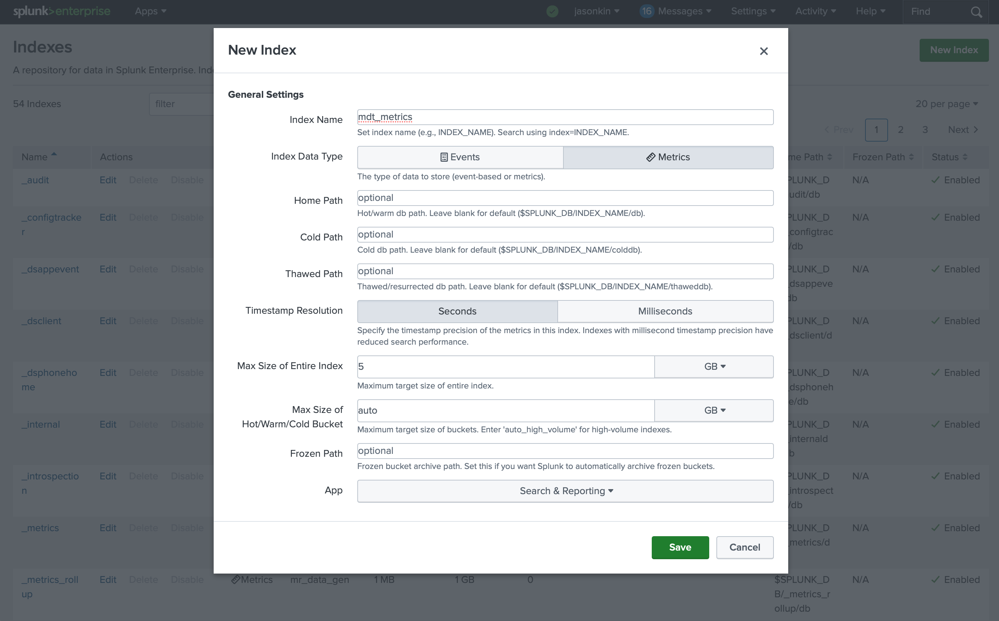
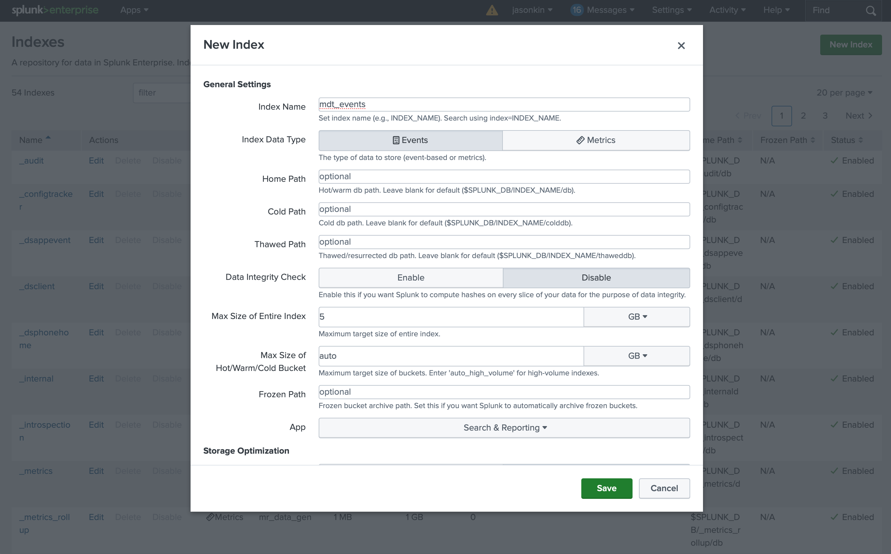
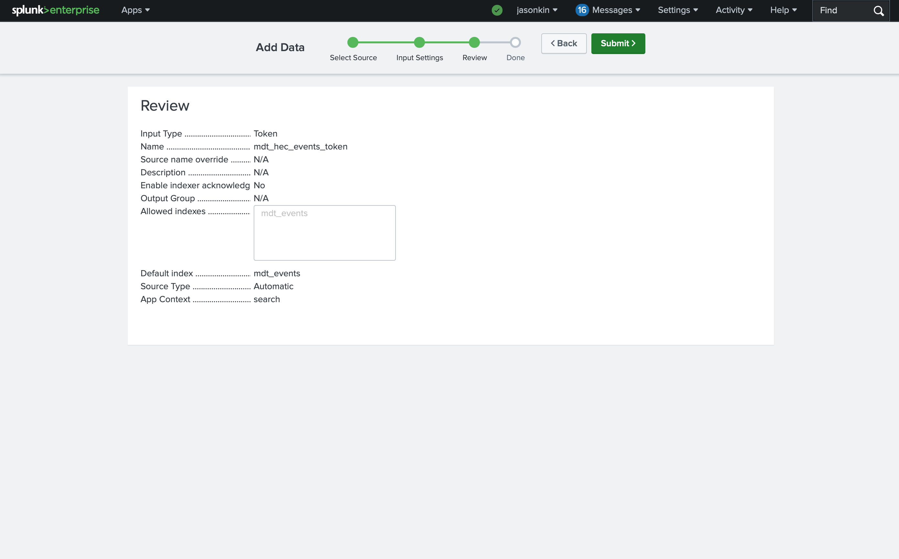

# Cisco Model-Driven Telemetry and Splunk

This repo documents the process for collecting Cisco model-driven telemetry (MDT) data using Telegraf and sending it Splunk via the HTTP Event Collector (HEC).

## Understanding Splunk Indexes

Splunk uses indexes to make data accessible for searching and analysis. There are two types of indexes: events and metrics. Events indexes are general purpose indexes that are appropriate for unstructured or structured data while metrics indexes are intended for structured data with discrete numerical values only.

Some of the MDT data we might send to Splunk is non-numeric and therefore we need to use an events index for that data and a metrics index for the numerical data.

While it is technically possible to send all of the data to an events index, whether numeric or not, the Splunk metrics index is better suited to search and analyze large quantities of time-series data using statistical methods. MDT can produce large quantities of numerical time series data. Therefore, it is desirable to use metrics indexes for numerical MDT data whenever possible.

## Understanding Telegraf

As of July 2025, it is not possible to send MDT data directly from Cisco devices to Splunk. Therefore, an intermediary is required that can accept data via gRPC and send it on via a suitable transport to Splunk. This is where Telegraf comes in. Telegraf is an open-source agent from InfluxData intended for processing time-series data. It collects data from data sources, transforms the data if necessary, and then sends it on to data destinations. It accomplishes this via input plugins, output plugins and processor plugins. When using Telegraf for Cisco MDT data and Splunk, we will use the `cisco_telemetry_mdt` input plugin to collect data from Cisco devices and the `http` output plugin to send the data to Splunk.

Instructions on how to install Telegraf can be found on the [InfluxData web site](https://www.influxdata.com/get-telegraf/).

## Configuring Cisco Devices for MDT

There are two ways to get telemetry out of a Cisco IOS-XE device via MDT, dial-in and dial-out. Dial-out, the default mode, has the Cisco device initiate the connection to the collector, while dial-in has the collector connect to the device to initiate the session. In this example we are going to configure dial-out manually on the device.

To start, login to the Cisco IOS-XE device and enable netconf-yang. It is required in order to use MDT.

```text
netconf-yang
```

When you enable netconf-yang, the device will now listen on port 830 for NETCONF sessions over SSH. It is best practice to configure an ACL on the NETCONF SSH listener. In our case, we are not going to configure the device via NETCONF so we will just use an ACL that denies all access. Configure your ACL as appropriate.

```text
ip access-list standard netconf
 deny any
ipv6 access-list netconf-v6
 deny any any
netconf-yang ssh ipv4 access-list name netconf
netconf-yang ssh ipv6 access-list name netconf-v6
```

Now configure an MDT dial-out session. For now, let's just send the one minute CPU utilization of the device.

```text
telemetry ietf subscription 101
 encoding encode-kvgpb
 filter xpath /process-cpu-ios-xe-oper:cpu-usage/cpu-utilization/one-minute
 stream yang-push
 update-policy periodic 6000
 receiver ip address 192.168.1.100 57000 protocol grpc-tcp
```

> Note: update the receiver IP address to be the IP address of your Telegraf server.

This configuration will send the CPU utilization to Telegraf using gRPC on TCP port 57000 every 60 seconds. `update-policy periodic` is specified in 100ths of a second.

## Configuring Telegraf for MDT

> Note: The full example configuration for Telegraf can be found in the [telegraf.conf](telegraf.conf) file in this repo.

The Telegraf configuration file is normally stored in `/etc/telegraf/telegraf.conf`. If this file doesn't exist, create it and update the hostname.

```ini
[agent]
  hostname = "telegraf.example.com"
```

Enable and start Telegraf if necessary.

```bash
systemctl enable telegraf
systemctl start telegraf
```

Or restart Telegraf to update the configuration if it has already been enabled and started.

```bash
systemctl restart telegraf
```

At a minimum, we need to configure an input and an output for Telegraf to do anything useful. The following configuration will enable the `cisco_telemetry_mdt` input plugin and configure it with some sensible defaults.

```ini
[[inputs.cisco_telemetry_mdt]]
  transport = "grpc"
  service_address = ":57000"
  max_msg_size = 32000000
  [inputs.cisco_telemetry_mdt.aliases]
    ifstats = "ietf-interfaces:interfaces-state/interface/statistics"
  [inputs.cisco_telemetry_mdt.grpc_enforcement_policy]
    permit_keepalive_without_calls = true
    keepalive_minimum_time = "1m"
```

At this point Telegraf will be listening for MDT data in gRPC format on TCP port 57000. It can be useful to log the received data locally for debugging purposes. To achieve this, we can use the `file` output plugin. The following configuration will write data received by Telegraf to `/tmp/telegraf.out`.

```ini
[[outputs.file]]
  files = ["/tmp/telegraf.out"]
  data_format = "json"
```

> Note: here we are using the `json` data format, but there are others that may be useful as well, such as `influx` or `splunkmetric`.

After modifying the telegraf configuration, restart Telegraf in order for the changes to take effect.

```bash
systemctl restart telegraf
```

If we configured out Cisco device and Telegraf correctly, we should be able to see MDT data from our Cisco device in `/tmp/telegraf.out`.

```bash
$ cat /tmp/telegraf.out
{"fields":{"one_minute":0},"name":"Cisco-IOS-XE-process-cpu-oper:cpu-usage/cpu-utilization","tags":{"host":"telegraf.example.com","path":"Cisco-IOS-XE-process-cpu-oper:cpu-usage/cpu-utilization","source":"router1","subscription":"101"},"timestamp":1753299981}
{"fields":{"one_minute":1},"name":"Cisco-IOS-XE-process-cpu-oper:cpu-usage/cpu-utilization","tags":{"host":"telegraf.example.com","path":"Cisco-IOS-XE-process-cpu-oper:cpu-usage/cpu-utilization","source":"router1","subscription":"101"},"timestamp":1753300041}
```

## Configure Splunk for MDT Metrics

In your Splunk instance, create an events index in **Settings -> Indexes -> New Index**. Set the Index Name to "mdt_metrics" (or other appropriate name). Set the Index Data Type to "Metrics" and set the Max Size as appropriate for your Splunk instance.



Create an HTTP Event Collector for our metrics-type data in **Settings -> Data inputs -> HTTP Event Collector** -> **New Token**. Set the Name to "mdt_hec_metrics_token" (or other appropriate name) and click **Next**. Select "mdt_metrics" in Select Allowed Indexes and click **Review** and then **Submit**.


## Configure Telegraf to Send MDT to Splunk

In your Splunk instance, navigate to **Settings -> Data inputs -> HTTP Event Collector**. Click on **Show** in the Token Value column for the "mdt_hec_events_token" and "mdt_hec_metrics_token" and record the token values for each. We will use those to configure the HTTP output plugin for Telegraf.

In your Telegraf configuration, add an HTTP output for Splunk metrics.

```ini
[[outputs.http]]
  url = "https://splunk.example.com:8088/services/collector"
  insecure_skip_verify = true
  data_format = "splunkmetric"
  splunkmetric_hec_routing = true
  [outputs.http.headers]
    Content-Type = "application/json"
    Authorization = "Splunk c87173eb-825d-4dbb-a1b1-c7bbe9de019b"
    X-Splunk-Request-Channel = "f683b0f9-1d0f-4e17-b649-8020473ba6d9"
```

> Note: update the `url` and `Authorization` values as necessary for your Splunk instance. Use the token value you recorded above for your "mdt_hec_metrics_token". The `X-Splunk-Request-Channel` is a unique UUID identifying this sender (ie. Telegraf). It just needs to be unique per sender.

Restart Telegraf.

```bash
systemctl restart telegraf
```

In your Splunk instance, verify that you are receving metrics in the "mdt_metrics" index. Go to **Apps -> Search & Reporting** and put the follwing into the search:

```text
| mcatalog values(_dims) WHERE "index"="mdt_metrics" GROUPBY metric_name source
| rename values(_dims) AS dimensions 
| table metric_name dimensions source
```

This search will identify all metrics in the index "mdt_metrics" and list the available attributes (dimensions) and source. It is useful for seeing all metrics being collected for a particular index.

## Configure Splunk for MDT Events

As discussed previously, sometimes the data we are sending from MDT is non-numerical. In this case we need an events index to collect the data.

In your Splunk instance, create an events index in **Settings -> Indexes -> New Index**. Set the Index Name to "mdt_events" (or other appropriate name). Set the Index Data Type to "Events" and set the Max Size as appropriate for your Splunk instance.



Create an HTTP Event Collector for our events-type data in **Settings -> Data inputs -> HTTP Event Collector** -> **New Token**. Set the Name to "mdt_hec_events_token" (or other appropriate name) and click **Next**. Select "mdt_events" in Select Allowed Indexes and click **Review** and then **Submit**.



In your Telegraf configuration, add an HTTP output for Splunk events.

```ini
[[outputs.http]]
  url = "https://splunk.example.com:8088/services/collector/raw"
  insecure_skip_verify = true
  data_format = "json"
  use_batch_format = false
  # filter on xpath
  namepass = ["Cisco-IOS-XE-ios-events-oper*"]
  [outputs.http.headers]
    Content-Type = "application/json"
    Authorization = "Splunk 405aea3d-c043-45a0-a3a2-18becb1784fd"
    X-Splunk-Request-Channel = "ab3e61b7-0b4c-48fc-a277-71464ed98fd9"
```

> Note: update the `url` and `Authorization` values as necessary for your Splunk instance. Use the token value you recorded above for your "mdt_hec_metrics_token". The `X-Splunk-Request-Channel` is a unique UUID identifying this sender (ie. Telegraf). It just needs to be unique per sender.

In order to decide which metrics we should send as events, we use the namepass filter to filter certain MDT events to send to this output. Here we are only sending the IOS-XE operational events. One useful event in this group of events is BGP Peer State Changes. To configure a Cisco device to generate MDT on a BGP peer state change, add the following configuration to the router:

```text
telemetry ietf subscription 107
 encoding encode-kvgpb
 filter xpath /ios-events-ios-xe-oper:bgp-peer-state-change
 stream yang-notif-native
 update-policy on-change
 receiver ip address 192.168.1.100 57000 protocol grpc-tcp
 ```

> Note: update the receiver IP address to be the IP address of your Telegraf server.

Notice that here we are setting the update-policy to "on-change". That means this will only be sent when a BGP peer state changes, rather than periodically.

Restart Telegraf.

```bash
systemctl restart telegraf
```

In your Splunk instance, verify that you are receving events in the "mdt_events" index. Go to **Apps -> Search & Reporting** and put the follwing into the search:

```text
index="mdt_events"
```

This will display any events being received via MDT. However, the example above will require that a BGP state change actually happen, which may or may not be a regular occurance in your environment.
